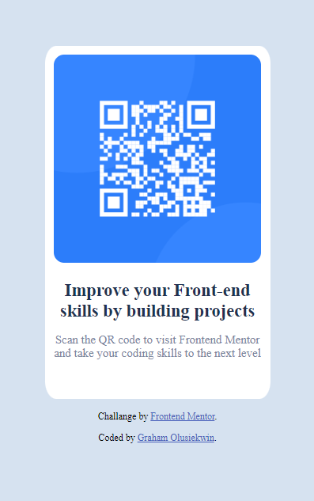

# Frontend Mentor - QR code component solution

This is a solution to the [QR code component challenge on Frontend Mentor](https://www.frontendmentor.io/challenges/qr-code-component-iux_sIO_H). Frontend Mentor challenges help you improve your coding skills by building realistic projects.

## Overview

### Screenshot

### Links

- Live Site URL: https://olusiekwin.github.io/QR-Code-Frontend-Mentor/

### Built with

-HTML

-CSS

### Author

- Frontend Mentor - [@Gramm](https://www.frontendmentor.io/profile/Gramm)
- Twitter - [@_olusiekwin_](https://www.twitter.com/_olusiekwin_)
